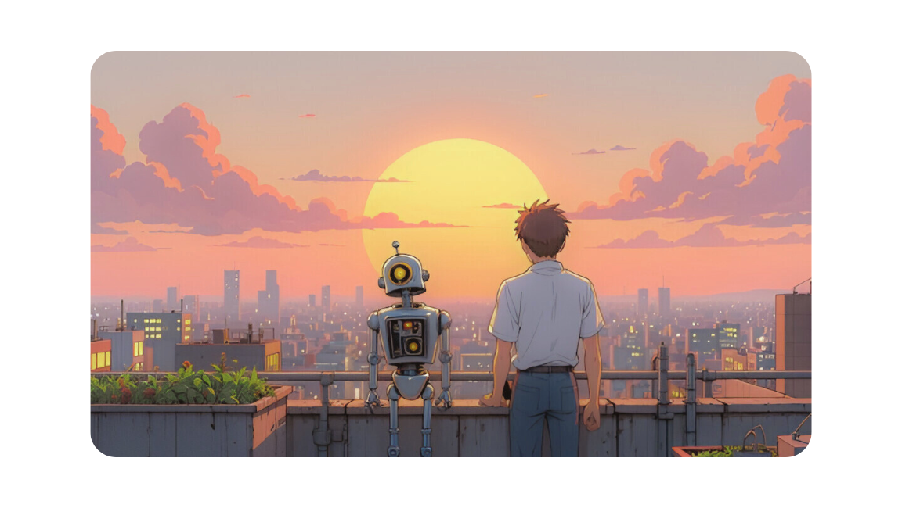

---
permalink: /
title: "Hey there! (❁´◡`❁)"
author_profile: true
redirect_from: 
  - /about/
  - /about.html
---  

{: .align-center width="1111px"}  

### How are you guys doing?
Well, I'm doing great just like you...thanks for asking, btw!

🔭 My curiosity lies in **Vision-Language modeling**, with a focus on **interpretability**, **efficiency**, **cross-modal generalization**, **multimodal reasoning**, **alignment & safety**!

📌Check out [**Multimodal/VLMs Research Hub**](https://github.com/thubZ09/vision-language-model-hub.git). I thought having a community-driven hub for multimodal researchers would be great. Contributions are welcome!

✍️ I enjoy jotting down my thoughts. You can find my blogs on [Medium](https://medium.com/@thube09), [Towards AI](https://pub.towardsai.net/), [InPlainEnglish](https://plainenglish.io/author/yash-thube) or in the brain dump section above. Also, here's my [reading list of papers](https://huggingface.co/collections/thubZ9/my-reading-list-677bbae8877a0efbab57392f) that have been keeping me up lately!
  
Outside of work, you’ll find me clicking random pictures, exploring astrophysics, or playing and watching a variety of sports!! - be it football, cricket, MMA, or Esports. A good book recommendation or a meaningful conversation? I’m all ears!

## 🤔What keeps me inspired?

📖Understanding Deep Learning by Simon Prince, Machine Learning Specialization by Stanford and many more. I like to share all the notes that I find helpful! You can have a look [here](https://github.com/thubZ09/vision-language-model-hub/tree/main/Notes).  

📰Newsletters like The Batch, TL;DR AI & AlphaSignal. 

🎥Channels (ML) like Stanford Online, 3Blue1Brown, Machine Learning Street Talk, Cognitive Revolution - How AI Changes Everything, Lex Fridman, Umar Jamil, Dwarkesh Patel, Yannic Kilcher, Matthew Berman and many more.  

🌟People like Andrej Karpathy, Andrew Ng, Ilya Sutskever, Yann LeCun, Aleksa Gordic and so many moree!

🎥Channels like Kurzgesagt, StarTalk, TED, Discover Connection, The Joe Rogan Experience, The Diary Of A CEO, The Infographics Show, Veritasium and Bright Side. 

## 📚Some of my favourite books!
- **The Three-Body Problem & The Dark Forest** by **Cixin Liu**. These novels explore humanity’s first encounters with alien intelligence, revealing the depths of strategic, evolutionary, and philosophical conflict. They present contemplation of cosmic civilization and have led me rethinking humanity's place in a vast, and often hostile, cosmic arena.
- **Eat That Frog** by **Brian Tracy**. This book is a cry against procrastination. It urges you to tackle your most daunting tasks first. It argues that by confronting our “frogs” early, we cut through overwhelm and unlock productivity that compounds over time, which I absolutely agree with. It felt like reading a manual on time management that invited me to transform small daily victories into a pathway for lasting achievement.
- **A Little Life** by **Hanya Yanagihara**. This one has taught me a lot! It explores the burden and beauty of trauma, urging us to find meaning in scars and to appreciate the delicate strength of our inner lives. It’s a reflection on how even the most broken spirits can echo with profound grace and empathy.
- **Superintelligence** by **Nick Bostrom**. How can we effectively encode our complex, multifaceted human values into AI systems so they truly understand and serve our subtle well-being instead of just following literal instructions? How do we ensure that an AI, tasked with goals like "make humans happy" or "solve hard problems," doesn't inadvertently cause harm by misinterpreting these directives?
- **Cosmos** by **Carl Sagan**. This is Sagan’s love letter to curiosity and a guide to finding awe in the ordinary. We are a way for the cosmos to know itself. The universe is bigger than our worries. Be curious.
- **Ikigai**. The intersection of what we love, what we’re good at, what the world needs, and what we can be paid for forms the bedrock of a fulfilling life. This book is a reminder to pursue that elusive “reason for being” that makes every day rich with meaning.
- **Cosmic Queries** by **Neil deGrasse Tyson**. It isn’t about the answers we have but about the questions we’ve posed - questions we don’t even know are right or valid. It's about how we investigate and why these investigations matter for our understanding of reality and our place within it.

## 👇Interesting Podcasts/Projects/Blogs
- [Tracing the thoughts of a large language model by Anthropic](https://transformer-circuits.pub/2025/attribution-graphs/biology.html)

- [Brian Cox (Joe Rogan Podcast)](https://youtu.be/Rc7OHXJtWco?si=rojKVixCGHr7Gw1C)

- [Neil deGrasse Tyson (Joe Rogan Podcast)](https://youtu.be/e8_vmWakyn4?si=-RvDHw6_D886rhfw)

- [Andrej Karpathy (Lex Fridman Podcast)](https://youtu.be/cdiD-9MMpb0?si=1PtizFt-uvhkE9o-)

- [Ilya Sutskever (Lex Fridman Podcast)](https://youtu.be/13CZPWmke6A?si=A9eFIilC--d4eWWn)

- [Yann Lecun (Lex Fridman Podcast)](https://youtu.be/5t1vTLU7s40?si=jeSK8GB-ffm6yvzY)

- [AlphaGo Documentary](https://youtu.be/WXuK6gekU1Y?si=DqVB_ogiDWzB_wLA)

- [PyTorch Documentary](https://youtu.be/rgP_LBtaUEc?si=VzII-WzJGbvncgyX)

- [Deepmind's Project Astra](https://deepmind.google/technologies/project-astra/)

- [Diffusion for World Modeling:
Visual Details Matter in Atari](https://diamond-wm.github.io/)

  