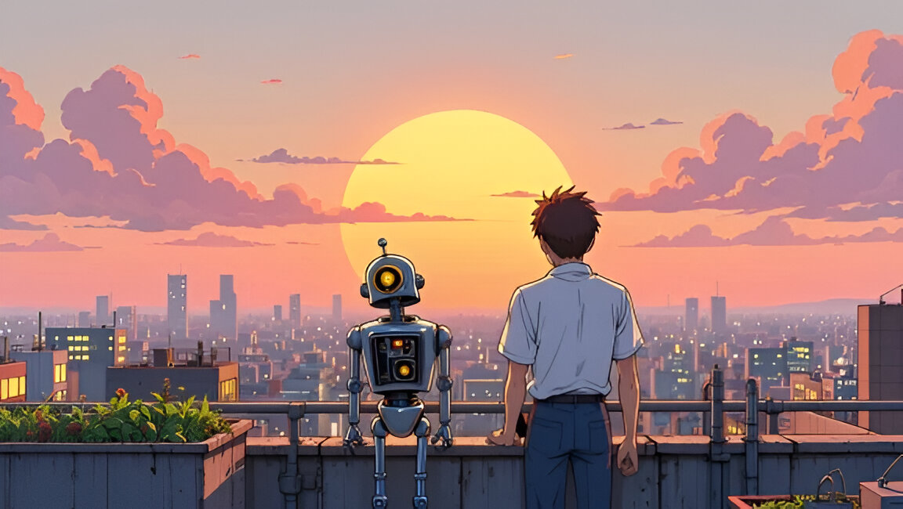

{: .align-right width="995px"}

### How are you guys doing?
Well, I'm doing great just like you...thanks for asking, btw! 😊 Here’s a glimpse into the things that light up my world!

🔭 I have deep curiosity and research interests in exploring **Multimodal Learning**, particularly **Vision-Language Models (VLMs), Large Multimodal Models (MLLMs),** with insights from **Computer Vision (CV)** & **Deep Reinforcement Learning (RL)**.

📌Check out the repository I've created - [**Vision-Language Models (VLMs) Research Hub**](https://github.com/thubZ09/vision-language-model-hub.git). I thought having a community-driven hub for multimodal researchers would be great. Contributions are welcome!

📚 I have a borderline obsession with research papers. Here's my [Reading List](https://huggingface.co/collections/thubZ9/my-reading-list-677bbae8877a0efbab57392f) for what’s been keeping me up lately!

✍️ I enjoy jotting down my thoughts. You can find my blogs on [Medium](https://medium.com/@thube09), [Towards AI](https://pub.towardsai.net/), [InPlainEnglish](https://plainenglish.io/author/yash-thube) or in the brain dump section👆.

🌿 Outside of work, you’ll find me clicking random pictures, exploring astrophysics, or playing and watching a variety of sports!! - be it football, cricket, MMA, or Esports. A good book recommendation or a meaningful conversation? I’m all ears!

## 🤔What Keeps Me Inspired

### **All things ML**
📖Understanding Deep Learning by Simon Prince, Machine Learning Specialization by Stanford and many more. I like to share all the notes that I find helpful! You can have a look [here](https://github.com/thubZ09/vision-language-model-hub/tree/main/Notes).  
📰Newsletters like The Batch (Deeplearning.AI), TL;DR AI & AlphaSignal.  
🎥Channels like Two Minute Papers, Stanford Online, 3Blue1Brown, Machine Learning Street Talk, Yannic Kilcher, Umar Jamil and many more.  
🌟People like Andrew Ng, Aleksa Gordić, Andrej Karpathy, Ilya Sutskever, Yann LeCun, Lex Fridman and so many moree!

### **Beyond ML**
📚Books(have read and recommended!): Eat That Frog, Cosmos, Ikigai, Brave New World, Fahrenheit 451, Astrophysics for people in a hurry.   
🎥Channels like Kurzgesagt, StarTalk, TED, Discover Connection, The Infographics Show, Veritasium and Bright Side.  

## 👇Interesting Podcasts/Documentries/Projects

- [Andrej Karpathy (Lex Fridman Podcast)](https://youtu.be/cdiD-9MMpb0?si=1PtizFt-uvhkE9o-)

- [AlphaGo Documentary](https://youtu.be/WXuK6gekU1Y?si=DqVB_ogiDWzB_wLA)

- [Ilya Sutskever (Lex Fridman Podcast)](https://youtu.be/13CZPWmke6A?si=A9eFIilC--d4eWWn)

- [Yann Lecun (Lex Fridman Podcast)](https://youtu.be/5t1vTLU7s40?si=jeSK8GB-ffm6yvzY)

- [PyTorch Documentary](https://youtu.be/rgP_LBtaUEc?si=VzII-WzJGbvncgyX)

- [Deepmind's Project Astra](https://deepmind.google/technologies/project-astra/)

- [Diffusion for World Modeling:
Visual Details Matter in Atari](https://diamond-wm.github.io/)

  