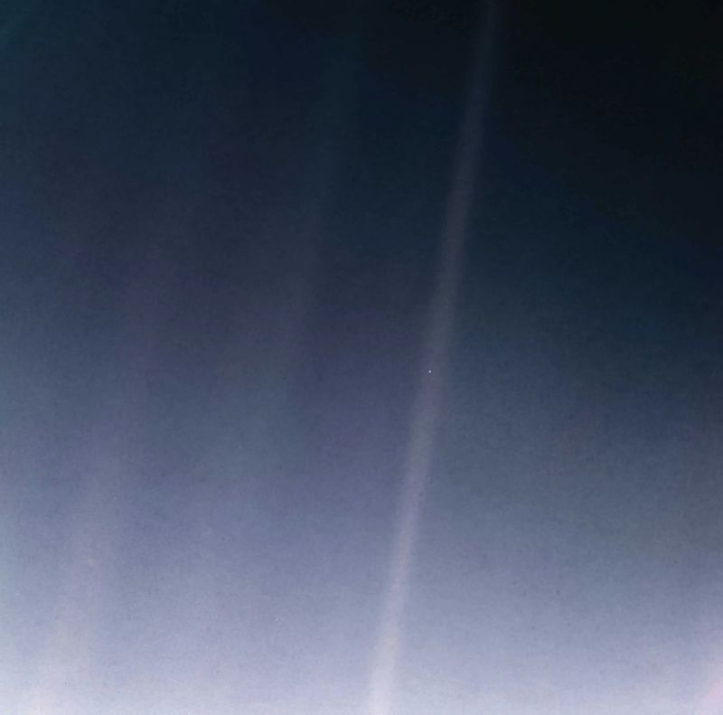

### The universe is bigger than your worries. Go be curious✨

Life often feels like a never-ending to-do list. We rush through days, weighed down by deadlines, obligations, and the noise of modern living. But what if the antidote to this chaos isn't found in productivity hacks or escapism, but in something far older and grander? Cosmos is Sagan's love letter to curiosity, a reminder that we're all made of stardust, and a guide to finding awe in the ordinary.

"We're made of star stuff" says Sagan. It's a humbling truth. The elements that compose our bones, blood, and breath - carbon, oxygen, iron - were forged in the fiery hearts of ancient stars. When those stars exploded, they scattered these ingredients across the cosmos, eventually coalescing into planets, oceans, and living beings. You, reading this, are the universe's way of understanding itself. 
It's easy to feel small in a vast cosmos, but Sagan flips that narrative: you are stardust evolved to wonder, to create, to love. That meeting you're dreading? The awkward text you sent? None of it matters in the grand scheme. Take a breath. The universe has survived supernovas and asteroid strikes - it can handle your bad hair day as well!

In 1990, Voyager turned its camera around and snapped a photo from 3.7 billion miles away. It was a "pale blue dot" suspended in a sunbeam!

Sagan's reflection: "Everyone you love, everyone you know, every human ever existed, lived out their lives on a mote of dust suspended in a sunbeam."

Arguments over politics, grudges, instagram likes - everything kinda feels absurd when you zoom out. Focus on what actually matters: kindness, humanity, wonder, and the people beside you on this floating rock.
Exploration isn't just for astronauts. Every time you google "why is the sky blue?" or stare at the moon, you're part of the same quest. Never stop asking "why?" curiosity isn't childish - it's how we grow. It pulls us out of ruts, fuels creativity, and reminds us that the world and the universe are still full of mysteries waiting to be solved. 

So how do we bring Cosmos into our daily lives? Stargaze once a week. No telescope needed; just look up. Those pinpricks of light overhead are the same ones that guided explorers, inspired poets, and witnessed the rise and fall of civilizations. Embrace a beginner's mind, wonder at ordinary things. Channel your inner 5-year-old. Text a friend a cool space fact. Watch a sunset together. Awe is contagious. 
Cosmos isn't about escaping life - it's about seeing it fully. As Sagan said, "We are a way for the cosmos to know itself." So the next time life feels heavy, step outside. Look up.   
**Life is messy, but you're stardust with a to-do list. The universe is bigger than your worries. Go be curious ✨**