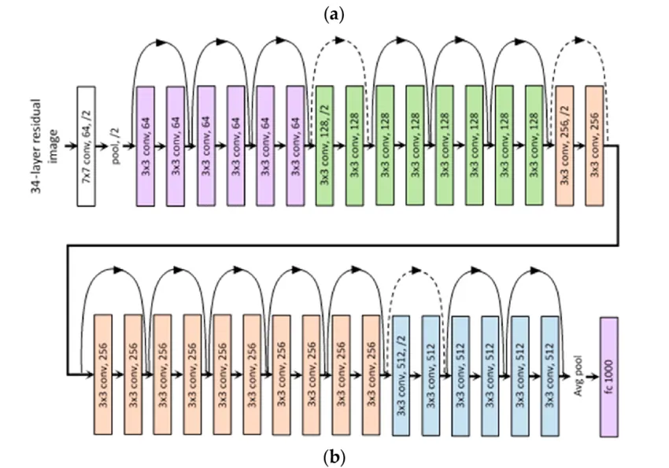

[Deep Residual Learning for Image Recognition](https://arxiv.org/abs/1512.03385)

**Deep Residual Networks (ResNets)** are a development in deep learning, designed to address the challenges associated with training deep neural networks. This architecture is pivotal in advancing image recognition and other tasks by enabling deeper networks to achieve better performance without succumbing to optimization difficulties. Here's a breakdown of ResNets.

### 📌The Problem with Deep Networks
Deep neural networks are powerful because they can learn intricate and hierarchical features from data. For example, in image recognition:
* Shallow Layers: Learn basic features like edges and textures.  
* Deeper Layers: Learn complex patterns, like shapes and objects.

### 📌The Degradation Problem
However, adding more layers to a network doesn't always improve its performance. Instead, it can lead to:  
* Accuracy Plateau: Performance stops improving beyond a certain depth.  
* Decreasing Accuracy: Deeper networks sometimes perform worse than shallower ones.  
* Higher Training Error: Surprisingly, deeper networks can struggle to fit the training data.

Due to optimization challenges, this issue arises because deeper networks find it harder to learn the right mappings.

### 📌The Solution: Residual Learning
ResNets solve these problems by introducing the concept of residual learning:  
* Instead of making each layer learn a complex mapping directly (denoted as H(x)H(x)), ResNets reformulate the problem. They let layers learn a residual mapping, F(x)=H(x)−xF(x) = H(x) - x, where H(x)H(x) is the desired mapping and xx is the input.  
* The original mapping is reconstructed as F(x)+xF(x) + x.

### 📌Why Residual Learning Works
* Simpler Optimization: It's easier for the network to learn F(x)F(x) (adjustments to the input) than H(x)H(x) (a completely new representation).  
* Identity Mapping: If the optimal solution is to simply pass the input to the next layer, residual learning makes it easy to achieve by pushing F(x)F(x) to zero.
* Shortcut Connections: ResNets use shortcuts to skip one or more layers.

### 📌How ResNets Are Built  
They consist of residual blocks. Each block:  
- Takes an input xx.  
- Passes xx through a series of layers to compute F(x)F(x).  
- Adds F(x)F(x) to the original input xx to produce the output, F(x)+xF(x) + x.

The result? Layers learn to make small tweaks to the input rather than starting from scratch.  
Network Depth
ResNets allow for extremely deep architectures, with successful implementations reaching over 1000 layers, thanks to their effective handling of optimization challenges.

    

### 📌Key Achievements of ResNets
- Overcoming Degradation: They enable the training of deep networks without the accuracy degradation problem.
- State-of-the-Art Performance: They achieved groundbreaking results across multiple tasks:  
✔️ImageNet Classification: Achieved a 3.57% error rate using an ensemble of ResNets.  
✔️Object Detection: Improved performance significantly on the COCO and PASCAL VOC datasets.  
✔️Object Localization: Delivered superior results on the ImageNet dataset.

- Generalisability: Residual learning is applicable to various datasets and tasks, highlighting its flexibility and robustness.

### 📌How Were They Validated
The researchers tested ResNets extensively:  
- Compared plain networks to ResNets of similar depth.  
- Demonstrated that plain networks suffered increasing training error as depth increased, while ResNets did not.  
- Trained ResNets with depths ranging from 18 to 152 layers on the ImageNet dataset.  
- Experimented with ultra-deep ResNets (over 1000 layers) on smaller datasets like CIFAR-10.

### 📌Why Are They Important
- Better Accuracy: Deeper ResNets outperform shallower models, achieving higher accuracy on complex tasks.  
- Efficiency: Shortcut connections simplify optimization without adding computational burden.  
- Scalability: They allow for the design of extremely deep networks without hitting optimization barriers.  
- Flexibility: Residual learning can be combined with other techniques, such as stronger regularization methods, to further enhance performance.

### 📌Future Directions
- Understanding Optimization: Why do plain networks struggle with optimization? Further research is needed to answer this.  
- Advanced Regularization: Combining residual learning with techniques like dropout and batch normalization to improve training.  
- Residual Learning Beyond Vision: Exploring applications of ResNets in areas like natural language processing, speech recognition, and reinforcement learning.

### 📌In Simple Terms: What Is a ResNet?
It is a type of neural network that uses "shortcuts" to bypass certain layers. Instead of learning everything from scratch, it learns the difference (or residual) between the input and the desired output. This makes it easier to train very deep networks, leading to better performance on tasks like image recognition.  

Imagine assembling a puzzle. Instead of starting from scratch each time you add a new piece, you begin with the previous pieces already in place. Now, your task is just to refine the picture by fitting new pieces into the existing framework.

ResNets revolutionized deep learning by making it feasible to train very deep networks. Their simplicity, scalability, and effectiveness have made them foundational in modern AI research and applications.

### Stay Curious☺️….see you in the next one!