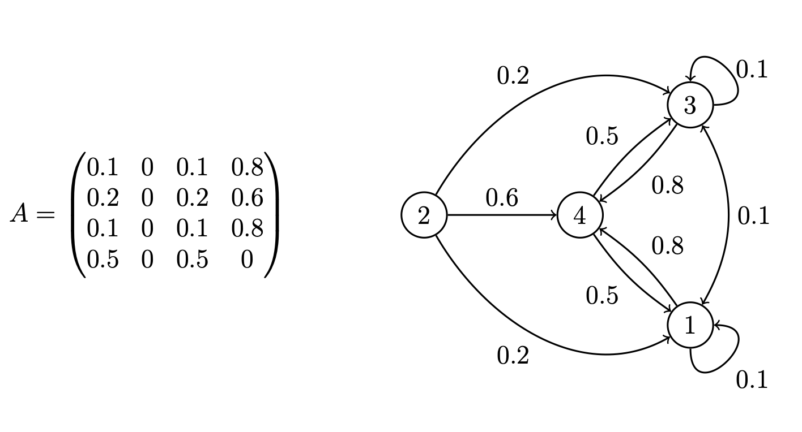

##### Abstract

Responsibility in complex networks extends beyond direct actions: players should also bear responsibility for the indirect effects within their supply chains or network. We introduce a novel framework to allocate responsibility for indirect environmental, social, and economic impacts across a dynamic network. Unlike static approaches, our framework accounts for the evolving structure of supply chains, financial systems, and other interconnected systems, where relationships change over time. We use the time-dependent Laplacian matrix to capture how responsibility propagates through the network, revealing a diffusion process that aligns with key axioms of fairness: linearity, efficiency, symmetry, and the independent player property. We show that approximating the responsibility measure preserves these properties, supporting the use of our framework as a rigorous and practical method to allocate responsibility in real-world networks.

---

##### Download

+ [You can find the paper here.](https://shs.hal.science/halshs-05046082v1)
<!-- + [Online appendix](appendix2.pdf)
+ [Code and data](https://github.com/pmichaillat/unemployment-gap) -->

---

##### Adjacency matrix A and its corresponding digraph G



---
<!-- 
##### Citation

Author 1 and Author 2. Year. "Title." *Journal* Volume (Issue): First page–Last page. https://doi.org/paper_doi.

```BibTeX
@article{AAYY,
author = {Author 1 and Author 2},
doi = {paper_doi},
journal = {Journal},
number = {Issue},
pages = {XXX--YYY},
title ={Title},
volume = {Volume},
year = {Year}}
```

---

##### Related material

+ [Presentation slides](presentation2.pdf)
 -->
